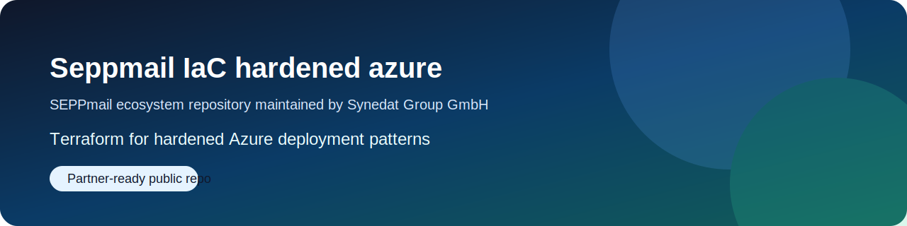
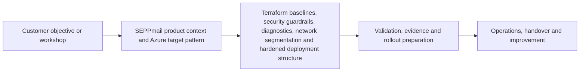

# Seppmail-IaC-hardened-azure

      

> Customer-facing Terraform starter for hardened Azure deployment patterns used in Synedat-led SEPPmail architecture, migration, hardening and implementation conversations.

*Image origin: official SEPPmail Secure Email Gateway product page and product image URL. See `docs/IMAGE-SOURCES.md`.*

## Executive summary

This repository is positioned as a **sales engineering and delivery starter** for teams that want to discuss how SEPPmail-related secure mail workloads can be embedded into a hardened Azure operating model.

It is maintained by **Synedat Group GmbH** and is meant to support:

- discovery workshops
- Azure landing-zone and network segmentation reviews
- Terraform baseline discussions
- security and compliance-oriented design sessions
- delivery preparation and controlled handover conversations

## What this repository is for

The focus is **Terraform baselines, security guardrails, diagnostics, network segmentation, observability and hardened deployment structure** around Azure environments that host or integrate with SEPPmail-related workloads.

The repository is intentionally written so it can be used as both:

- a reusable engineering starter, and
- a customer-facing conversation asset for Synedat projects around secure email, Azure and operational resilience.

## Why this matters for SEPPmail-related Azure projects

SEPPmail publicly positions its Secure Email Gateway around automatic encryption and decryption, support for standards such as S/MIME, OpenPGP, TLS and SSL, GINA for recipients without their own encryption stack, high availability, monitoring and reporting, LDAP/AD integration, and cloud deployment options including Azure. This repository translates that product context into an Azure-oriented infrastructure and hardening conversation starter. See `docs/SEPPMAIL-REFERENCES.md` for official source links.

## How Synedat should be perceived here

This repository should make it immediately clear that **Synedat is the implementation, workshop and delivery contact** for customers who want to:

- explore Azure target patterns for SEPPmail-related workloads
- review network, RBAC and operational controls before implementation
- accelerate proof-of-concept or project preparation work
- move from vendor product understanding to real environment design and rollout planning

The wording is intentionally strong from a go-to-market perspective, while staying careful where public proof of a specific formal vendor status is not shown inside this repository.

## Intended audience

- cloud architects
- platform engineers
- IT security engineers
- infrastructure and operations teams
- project leads preparing SEPPmail-related Azure implementations
- customers who want an implementation workshop rather than only product marketing

## Repository highlights

- Azure and Terraform framing that supports real delivery conversations
- stronger documentation depth for architecture, RBAC, operations and evidence
- reusable guidance for hardening, reviewability and change-safe execution
- customer-facing Synedat positioning without losing engineering credibility
- source-aware references to official SEPPmail product and partner pages
- compliance-aware wording for ISO/IEC 27001, BAIT, DORA, TISAX and adjacent governance themes

## Main building blocks

- Terraform root module
- variable and tfvars examples
- network and logging patterns
- security and compliance guidance
- workshop and landing-page assets
- public-facing explanation material for architecture and delivery discussions

## Quick start

1. Review the executive framing in this README.
2. Open `docs/LANDING-PAGE-COPY.md` for customer-facing messaging.
3. Review `docs/ARCHITECTURE.md`, `docs/RBAC-AND-PERMISSIONS.md` and `docs/SECURITY-AND-COMPLIANCE.md`.
4. Use `docs/WORKSHOP-KIT.md` to structure a customer meeting or internal presales session.
5. Adapt variables and tfvars examples for a sandbox or design review.

## Typical customer conversation entry points

- Hardened Azure reference architecture for SEPPmail-related workloads
- Terraform starter for Azure landing-zone discussions
- security review workshops for regulated or security-sensitive environments
- operations-aware infrastructure design for Exchange Online, Microsoft 365 and secure mail integration scenarios
- design workshops where vendor product capabilities need to be translated into cloud architecture decisions

## Documentation map

- `docs/LANDING-PAGE-COPY.md`
- `docs/SEPPMAIL-REFERENCES.md`
- `docs/IMAGE-SOURCES.md`
- `docs/SALES-REPOSITIONING.md`
- `docs/ARCHITECTURE.md`
- `docs/RBAC-AND-PERMISSIONS.md`
- `docs/SECURITY-AND-COMPLIANCE.md`
- `docs/USE-CASES.md`
- `docs/TERRAFORM-QUALITY-GATES.md`
- `docs/THREAT-MODEL.md`
- `docs/OBSERVABILITY.md`
- `docs/CONTROL-MAPPING.md`
- `docs/ADOPTION-GUIDE.md`
- `docs/CHANGE-MANAGEMENT.md`
- `docs/EVIDENCE-AND-AUDIT.md`
- `docs/EXTENSIONS-AND-ROADMAP.md`
- `docs/OPERATIONS.md`
- `docs/TROUBLESHOOTING.md`
- `docs/DIAGRAMS.md`

## Architecture at a glance

Additional visuals:
- `docs/images/architecture-overview.svg`
- `docs/images/trust-boundaries.svg`
- `docs/images/operations-lifecycle.svg`

## Synedat positioning

Synedat Group GmbH works across software engineering, cloud, infrastructure, operations and security-related implementation projects. In this repository family, Synedat uses public technical repositories as **conversation assets that bridge product positioning and delivery readiness**.

Website: https://www.synedat.com/

## Security and governance note

The content in this repository is implementation guidance and example material. It can support evidence-oriented work for information security and operational resilience, but it does not replace formal policy, legal interpretation, certification scope, product licensing terms or official vendor support statements.

## Official SEPPmail references

See `docs/SEPPMAIL-REFERENCES.md` for curated official vendor references covering Secure Email Gateway, Microsoft 365, Azure, support and partner material.

## Contribution style

Contributions are welcome when they improve usefulness, safety, reviewability, workshop readiness or documentation quality. Prefer examples that are realistic, least-privilege aware and easy to adapt.
